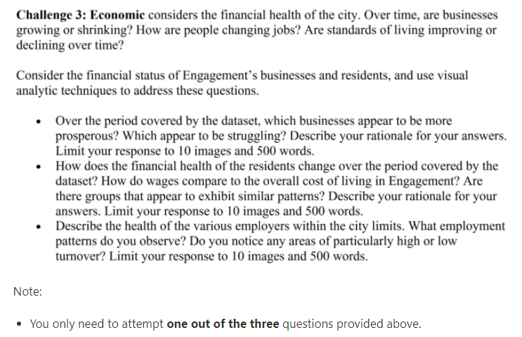

```{r setup, include=FALSE}
knitr::opts_chunk$set(echo = TRUE, eval = FALSE, message = FALSE, warning = FALSE, fig.retina = 3)
```

# The Task

This [takehome exercise](https://isss608-ay2021-22april.netlify.app/th_ex/th_ex03) aims to sharpen the skill of building data visualisation programmatically using appropriate tidyverse family of packages and the preparation of statistical graphics using ggplot2 and its extensions. The specifc requirements can be found in the screenshot below.



You can find the links to then datasets [here](https://vast-challenge.github.io/2022/). 

# Chosen Question

My analysis will focus on the Question 2 - "How does the financial health of the residents change over the period covered by the dataset? How do wages compare to the overall cost of living in Engagement? Are there groups that appear to exhibit similar patterns? Describe your rationale for your answers. Limit your response to 10 images and 500 words."

# Approach

In my opinion, each sub-opinion can have both an "obvious" answer, or a metric that is readily available in the data, and a "derived" answer, one that gathers multiple data points to triangulate the information needed. I will try to get bot types of answers. 

## Sub-Question 1 
"How does the financial health of the residents change over the period covered by the dataset?" 

### "Obvious" Answer

We evaluate the the "financialStatus" column in the datasets classified under *ParticipantStatusLogs.* 

### "Derived" Answer
To solve this question, I define what financial health meant, and build a granular visual understanding of each part of the "equation" so that the user has a fuller understanding of the financial health of residents in Engagement. 

Financial health is defined as a state of 

1. A steady flow of income
To determine this, we can use the "Category" called "Wage" from the dataset *FinancialJournal.* 

2. Rare changes in expenses
To determine this, we can use the "Category" called "Education", "Food", "Recreation" and "Shelter" from the dataset *FinancialJournal.* 

3. A cash balance that is growing. 
To determine this, we can use the "availableBalance" and "weeklyExtraBudget" from *ParticipantStatusLogs.* 

## Sub-Question 2 
"How do wages compare to the overall cost of living in Engagement?" 

### "Obvious"/ "Derived" Answer

We can use the "Derived" Answer from Sub-Question 1. Which does hint that the right way to answer Sub-Question 1 would be to use its "Obvious" answer. 

It might also give us a hint at the type of visual storytelling we should be doing with this question. Sub-Question 1 could give us a macro view on the issue, while Sub-Question 2 allows us to explore the issue in detail. 

## Sub-Question 3

Are there groups that appear to exhibit similar patterns?

### Obvious Answer

Given that we are ultimately weighing the living costs against income, it would make sense to categorise the participants based on either and their sub-components. 

On the income side, this would largely mean categorising based on how much the participant brings in, and the number of hours worked. 

On the cost of living side, this would mean categorising baesd on the proportion of income he or she spends on each type of expense: "Education", "Food", "Recreation" and "Shelter". 

On the side of considering both income and cost of living, this would mean categorising them into savers - or people with more income than expense, and spenders - people with more expense than income. 

### Derived Answer

We could use academic papers as a guide to determine how people should be categorised. However, Prof Kam has noted that this is more data-directed instead of explorative. In my opinion, that means that I would be skewing the user's exploration by skewing the "type" of person they can derive. Hence, I will veer away from this direction.

# Exploration

Having locked down our approach, we use it as a guide to explore the data using [R for Data Science](https://r4ds.had.co.nz/exploratory-data-analysis.html) as a guide.

## Initialisation

### Getting Packages

The packages required are tidyverse (included relevant packages for data analyses such as ggplot2, readr and dplyr), readxl, ggrepel and knitr.

The code chunk below is used to install and load the required packages onto RStudio.

```{r}
packages = c('tidyverse')
for(p in packages){
  if(!require(p,character.only = T)){
    install.packages(p)
  }
  library(p,character.only = T)
}
```

### Getting Data 

The main datasets needed are: *ParticipantStatusLogs* and *FinancialJournal.* Since both datasets are in CSV format, we use the read_csv() of the readr package is used to import the data. 

This is a trivial task for "FinancialJournal" since there is only 1 CSV file. 

```{r}
financialJournal <- read_csv("data/FinancialJournal.csv")
glimpse(financialJournal)
```

We also convert the data into RDS format since it exceeded Git's recommended memory limits. 

```{r}
saveRDS(financialJournal, 'data/financialJournal.rds')
financialJournal <- readRDS('data/financialJournal.rds')
head(financialJournal)
```

### Data Wrangling

 

## Sub-Question 1 


